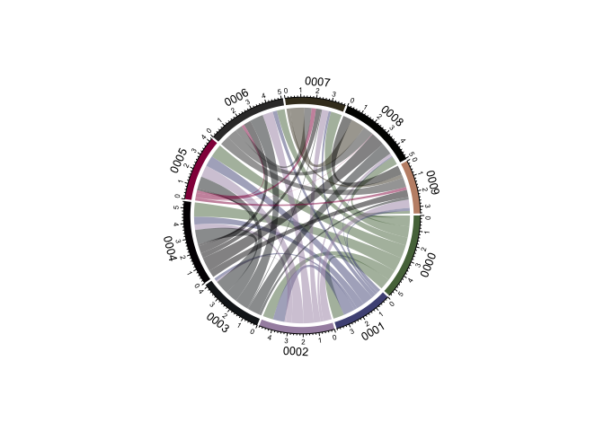
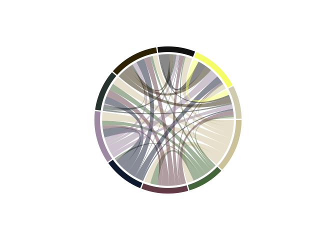
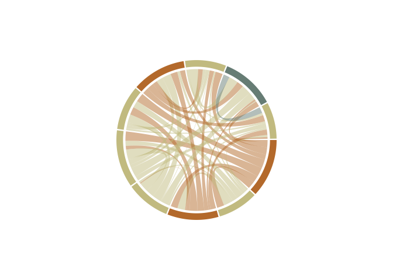
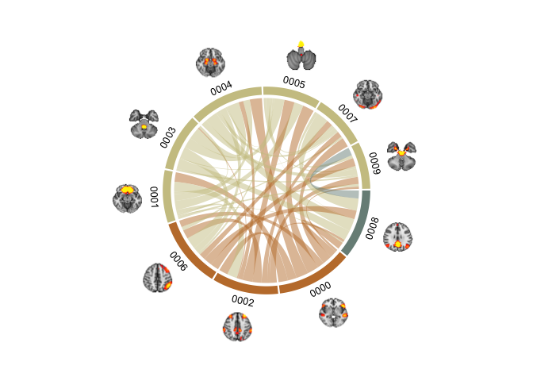
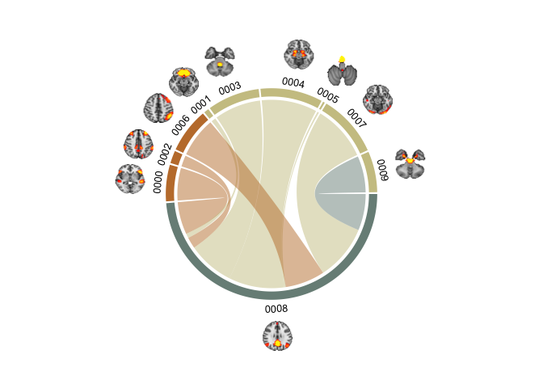
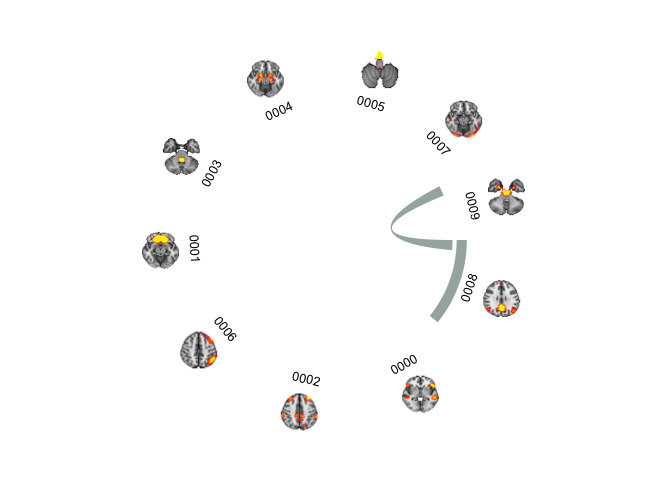
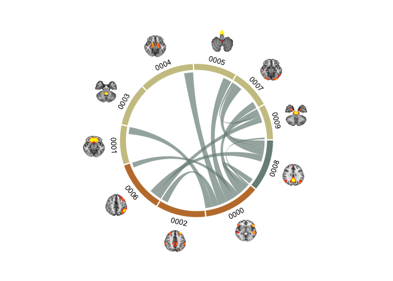
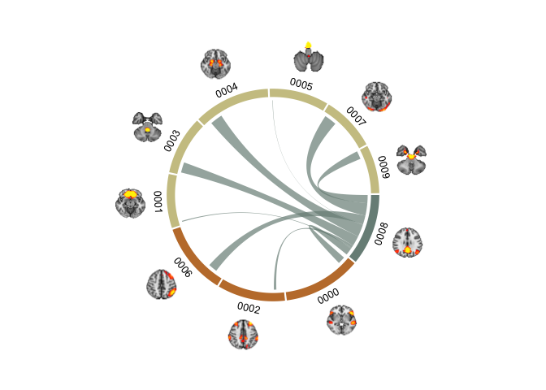

Last post was definately my most succesful (and I have so much experience :P). But it was fun with all the feedback and appreciation. So I'll continue with a little more plotting. Circular plots are becoming more and more popular in for visualising associatetions between different phenomena. I think they look pretty cool, and while I have not yet published a paper with it, I did prep a lot of scripts for plotting my analysis results with it, with BRAINS! because, brains make it better. Always. 

So here we go. Let's start out with the data from the last post I did. Reading in the images, giving them names, and some values.


```r
library(tidyverse); library(png);
```

```r
DATA = data.frame(images = list.files("brainSlices/single", full.names = T), stringsAsFactors = F) %>% 
  mutate(
    names = gsub("[a-zA-Z]|[[:punct:]]","", images),
    values = sample(0:100, size=nrow(.), replace = T)
  )
head(DATA)
```

```
##                              images names values
## 1 brainSlices/single/0000_trans.png  0000     56
## 2 brainSlices/single/0001_trans.png  0001     77
## 3 brainSlices/single/0002_trans.png  0002     10
## 4 brainSlices/single/0003_trans.png  0003     15
## 5 brainSlices/single/0004_trans.png  0004     10
## 6 brainSlices/single/0005_trans.png  0005     76
```

Ok, so a circular plot is used to depict a relationship. So, a dataframe with one value per brain network (in this case) will not suffice. I will need values that way something about the relationship between pairs of brain networks. So, if we want pair-wise correlations between 40 networks, that is (40x40)/2 - 40, i.e. 40x40 gives us a matrix of correlations, but they are organized in top and bottom triangles that are identical. Since we just need the one triangle, ergo dividing by 2. And then we subtract 40, which is the diagnoal, that is each networks correlation with it self, which is obviouslye 1 and irrelevant. 


```r
(40*40)/2-40
```

```
## [1] 760
```

mmm 760 values is a biiiiit much for a tutorial. Lets grab 10 networks, and skip all the rest for the purpose of this tutorial. 


```r
(10*10)/2-10
```

```
## [1] 40
```

40 pairwise correlations are a bit easier to work with. Let just get to creating the data. We'll be using the `combn` function that will generate the all pair-wise combinations of our shortlisted brain networks.


```r
PAIRS = combn(DATA$names[1:10], 2) %>% t %>% as.data.frame(stringsAsFactors=F)
names(PAIRS) = paste0("Network", 1:2)
head(PAIRS)
```

```
##   Network1 Network2
## 1     0000     0001
## 2     0000     0002
## 3     0000     0003
## 4     0000     0004
## 5     0000     0005
## 6     0000     0006
```


and lets fabricate some correlations. 


```r
PAIRS$cor = sample(seq(-1,1,.01), nrow(PAIRS), replace = T)
head(PAIRS)
```

```
##   Network1 Network2   cor
## 1     0000     0001 -0.77
## 2     0000     0002  0.73
## 3     0000     0003  0.00
## 4     0000     0004  1.00
## 5     0000     0005 -0.94
## 6     0000     0006 -0.55
```

Alright, getting started with a circular plot (or a chord diagram) is not very hard. We'll be using the `circlize` package, which is what I have tampered with before. I did a quick search before this post and didn't find anything that stuck out more than this package, so I'll stick with it. If you have other chord diagram recommendations or requests, let me know in the comments and I'll have a look at it.

Let's get to it! To plot a using `circlize` is farily easy. The first two columns need to contain the pairs that are connected, and the third column needs to be the value they are connected by. That is how we set it up: Netwok1, Network2, Correlation. I am pre-allocating the track heights for the outer walls `preAllocateTracks = list(track.height = 0.25))`. You can play around with what you like here.


```r
library(circlize)
```

```r
chordDiagram(PAIRS, preAllocateTracks = list(track.height = 0.25))
```

<!-- -->

Boom! Chord diagram! Now, notice how the entire viewport has been set. `circlize` will create the enitre plot space, and I have not figured out how to override this (like adding transparent background etc.). But since I have [ImageMagick](www.imagemagick.org) I have very easy ways of manipulating the images afterwards, so I don't really mind. 

Ok now, the plot is a little "gritty" for me. I don't really like the many text annotations, as I want to put in some of my own in stead. We can remove the text annotations with the call `annotationTrack = c("grid")`


```r
chordDiagram(PAIRS, annotationTrack = c("grid"),preAllocateTracks = list(track.height = 0.25))
```

<!-- -->


Nice, it's a little cleaner for me to work with now. And notice how the colors changed!

`circlize` has pretty nice color palettes, and it will randomy select one of them each time it is called. This is convenient when you just want a fast plot, but if you want to use custom colors (because they might correspond to other plots you have, or groups etc.) you'll need to do some grunt work. I'll group our brain networks somewhat haphazarously into 3 groups (networks of networks), so we can assign colors by the groups in stead. I'll use `wesanderson` colours, for simplicity and fun!


```r
library(wesanderson)
```

```r
# Assign group in the original data frame
DATA$Group = sample(c("Attention","Memory","Executive"), nrow(DATA), replace = T) %>% as.factor()

# Get wesanderson colours, turn the vector into characters, and then use the factor numbers of DATA$Group to assign colour.
DATA$gColor = wes_palette("Moonrise2",3) %>% as.character %>% 
  .[as.numeric(DATA$Group)]

head(DATA)
```

```
##                              images names values     Group  gColor
## 1 brainSlices/single/0000_trans.png  0000     56 Executive #C27D38
## 2 brainSlices/single/0001_trans.png  0001     77    Memory #CCC591
## 3 brainSlices/single/0002_trans.png  0002     10 Executive #C27D38
## 4 brainSlices/single/0003_trans.png  0003     15    Memory #CCC591
## 5 brainSlices/single/0004_trans.png  0004     10    Memory #CCC591
## 6 brainSlices/single/0005_trans.png  0005     76    Memory #CCC591
```

Now, this might feel a little odd, but we need to use the original data to add the colours we want. This is because the data the chord diagram is using is pair-wise, so the data is just not ordered in a way that is convenient to work with when you want to set one colour per network. For instance, neither of the network columns in `PAIRS` contains **all** the networks, they're each -1, so there is no complete list of the networks in the file. Thus, we will also struggle to create a complete list of colours and groups. So we will provide the values from the original data file to provide the colours we want.


```r
chordDiagram(PAIRS,annotationTrack = c("grid"), preAllocateTracks = list(track.height = 0.3), 
             order=DATA$names, grid.col = setNames(DATA$gColor, DATA$names))
```

<!-- -->

whoop! Now, you'll notice I used a command called `setNames` when adding the colours. This is because `circlize` wants a names vector for colours, so it know exactly which network should be which colour. In this way, it does not matter which order you provide the network names in (through the `order` call), the colours are always assigned correcly. Nice!

Ok, notice how not all the networks in one group come after eachother in the wheel. For the wheel to make true sense, to me at least, all networks in a group should cluster together. This should be a farily easy task to manage. We order `DATA` by the group, and provide this new ordered list to the function.


```r
oDATA = DATA %>% arrange(Group)
chordDiagram(PAIRS,annotationTrack = c("grid","name"), preAllocateTracks = list(track.height = 0.3), 
             order=oDATA$names, grid.col = setNames(oDATA$gColor, oDATA$names))
```

<!-- -->

Now, we're cooking! Let's get some text annotations in there. Like in the previous tutorial, we'll need to do this through a loop. If I ever get around to learning to use `purr` I'll get back to this and probably make it more efficient and pretty. For now, loops are easy for my brain to work with.


Time for some brains! Like in the last tutorial, the brain images need to be read in one by one and added sequentially to the plot. We'll use the same technique as for the text annotations. Notice how we here are not going to be adding the images to the plot like in `ggplot`. But circlize keeps the viewport open and continues to write to it untill a new `chordDiagram` is called, or the diagram is cleared with `circos.clear`.

First, we need to get the coordinates of our different sections. `circlize` had functions to grb this, by their name. We'll start with the one names `0000`.

```r
xplot=get.cell.meta.data("xplot","0000")
```

Now, this thing was new and I did not have to have it before. But the x coordinate for the first section should be 360, not 0. So we need to make a small adjustment.

```r
# Small workaround because coordinate 0 should be 360
if(xplot[1] == 0) xplot[1] = 360
```


We'll be using a package called `aspace` to create radial coordinates, which we need when working with a circle. I'm not going to take credit for figuring this particular part out. At the time, I was collaborating with another lab and [Tobias Kaufmann](https://twitter.com/TobKaufmann) generously shared this bit of code with me.


```r
library(aspace)
```


```r
x=.86*cos(as_radians((xplot[2]+xplot[1])/2))
y=.86*sin(as_radians((xplot[2]+xplot[1])/2))
```


```r
chordDiagram(PAIRS,annotationTrack = c("grid","name"), preAllocateTracks = list(track.height = 0.3), 
             order=oDATA$names, grid.col = setNames(oDATA$gColor, oDATA$names))

DATA$images[grep("0000", oDATA$images)] %>% 
  readPNG() %>% 
  rasterImage(x-0.09, y-0.09, x+0.09, y+0.09)
```

<!-- -->


```r
chordDiagram(PAIRS,annotationTrack = c("grid","name"), annotationTrackHeight=c(0.05, 0.01), preAllocateTracks = list(track.height = 0.3), 
             order=oDATA$names, grid.col = setNames(oDATA$gColor, oDATA$names))

u=0
for(si in get.all.sector.index()){
  xplot=get.cell.meta.data("xplot",si)
  u=u+1
  
  # Small workaround because coordinate 0 should be 360
  if(xplot[1] == 0) xplot[1] = 360
  
  x=.86*cos(as_radians((xplot[2]+xplot[1])/2))
  y=.86*sin(as_radians((xplot[2]+xplot[1])/2))
  
  DATA$images[grep(si, oDATA$images)] %>% 
    readPNG() %>% 
    rasterImage(x-0.09, y-0.09, x+0.09, y+0.09)
}
```

<!-- -->

Brain chord diagram! (malapropos: check out my friend's consultancy page [BrainChord](http://www.brainchord.co.uk/) - "We help women to optimise their work performance while taking care of their brain health and wellbeing". She does some excellent work!).

These plots tok a lot of time to get nice. Even with the help of Tobias' radian script (which I would not have figured out on my own). The clue lies in the pre-allocation of track heights to get it working. `preAllocateTracks = list(track.height = 0.3)` creates space outside the rim of the plot for the brains to be plotted, without this there is not enough room in the viewspace to get them in. `annotationTrackHeight=c(0.05, 0.01)` sets the sizes of the section colour and name widths, here I scrunch them a bit together so the diagram does not become too large. It require quite some fiddling with to get it looking nice. But once done, it is easy enough to continue using the same code to get it working.

I'm going to do one more thing before I stop. I find it hard to see the connections nicely when there are so many in a single diagram. What we can to is to plot the chords for each group seperately, and make three plots instead of one. Now, you'd think that just subsetting the data should suffice. Let have a look at that first.


```r
# Grab all the names of the networks in group "Attention"
networks = oDATA$names[oDATA$Group %in% "Attention"]

# Subset the PAIRS data frame to those networks only
SubsetPairs = PAIRS %>% filter(Network1 %in% networks | Network2 %in% networks)

# Plot it!
chordDiagram(SubsetPairs,annotationTrack = c("grid","name"), annotationTrackHeight=c(0.05, 0.01), preAllocateTracks = list(track.height = 0.3), 
             order=oDATA$names, grid.col = setNames(oDATA$gColor, oDATA$names))

u=0
for(si in get.all.sector.index()){
  xplot=get.cell.meta.data("xplot",si)
  u=u+1
  
  # Small workaround because coordinate 0 should be 360
  if(xplot[1] == 0) xplot[1] = 360
  
  x=.86*cos(as_radians((xplot[2]+xplot[1])/2))
  y=.86*sin(as_radians((xplot[2]+xplot[1])/2))
  
  DATA$images[grep(si, oDATA$images)] %>% 
    readPNG() %>% 
    rasterImage(x-0.09, y-0.09, x+0.09, y+0.09)
}
```

<!-- -->

That does not look right. See how the networks in the group are made larger, while the others are bunched up in a corner? That's not what we want. We want all the networks plotted as before, but we want to highlight the chords from the network we are plotting. I've found that using HEX alpha codes is the best way to go. Short intro to HEX colours, HEXs code for red, blue and green with pairs of digits succeeding a hash. Usually, most HEXs are only 6 digits, however, 8 digit HEXs also code for the opacity (or alpha/transparency) of the coded colour. You'll notice we have 6 digits in our HEX, and so we'll ass two more, to code for alpha. You can have a look at alpha-codes for HEX [here](https://css-tricks.com/8-digit-hex-codes/)


```r
oDATA = oDATA %>%
  mutate(gColorA = ifelse(Group %in% "Attention", 
                          paste0(gColor,"B3"), # alpha=70%
                          paste0(gColor,"00"))) # alpha=0%

# Plot it!
chordDiagram(PAIRS,annotationTrack = c("grid","name"), annotationTrackHeight=c(0.05, 0.01), preAllocateTracks = list(track.height = 0.3), 
             order=oDATA$names, grid.col = setNames(oDATA$gColorA, oDATA$names))

u=0
for(si in get.all.sector.index()){
  xplot=get.cell.meta.data("xplot",si)
  u=u+1
  
  # Small workaround because coordinate 0 should be 360
  if(xplot[1] == 0) xplot[1] = 360
  
  x=.86*cos(as_radians((xplot[2]+xplot[1])/2))
  y=.86*sin(as_radians((xplot[2]+xplot[1])/2))
  
  DATA$images[grep(si, oDATA$images)] %>% 
    readPNG() %>% 
    rasterImage(x-0.09, y-0.09, x+0.09, y+0.09)
}
```

<!-- -->

We're getting there, but it's not what we are truly after. We want the sections to still show, but the chords to change colour. That is thankfully not so hard, you can spacify both the chord and the chord border colour in circlize if you want. We'll stick to the chord colour. We will assign the `grid.col` colours with the coloumn without the alpha set (which effectively means alpha is 100%), and then use the columns with the alpha set with the `col` specification.


```r
chordDiagram(PAIRS,annotationTrack = c("grid","name"), annotationTrackHeight=c(0.05, 0.01), preAllocateTracks = list(track.height = 0.3), 
             order=oDATA$names, grid.col = setNames(oDATA$gColor, oDATA$names), col = setNames(oDATA$gColorA, oDATA$names))

u=0
for(si in get.all.sector.index()){
  xplot=get.cell.meta.data("xplot",si)
  u=u+1
  
  # Small workaround because coordinate 0 should be 360
  if(xplot[1] == 0) xplot[1] = 360
  
  x=.86*cos(as_radians((xplot[2]+xplot[1])/2))
  y=.86*sin(as_radians((xplot[2]+xplot[1])/2))
  
  DATA$images[grep(si, oDATA$images)] %>% 
    readPNG() %>% 
    rasterImage(x-0.09, y-0.09, x+0.09, y+0.09)
}
```

<!-- -->

But what is this? Why are there suddenly coloured chords that are NOT part of the Attention group? Well, when colouring the chords only, you can't set the colour by the network (or section), because it will colour **all** chords connecting to the section. What we need, is to specity the colour of **each** chord. So instead of creating an hex alpha colour code in the original data, we should set it in the `PAIRS` dataframe, that has all the pair-wise connections.


```r
# Grab all the names of the networks in group "Attention"
networks = oDATA %>% filter(Group %in% "Attention") 

# Subset the PAIRS data frame to those networks only
SubsetPairs = PAIRS %>% filter(Network1 %in% networks | Network2 %in% networks)

PAIRS = PAIRS %>%
  mutate(cColor = ifelse(Network1 %in% networks$names | Network2 %in% networks$names , 
                         networks$gColorA %>% unique(), 
                         "#00000000")) # transparent black


chordDiagram(PAIRS,annotationTrack = c("grid","name"), annotationTrackHeight=c(0.05, 0.01), preAllocateTracks = list(track.height = 0.3), 
             order=oDATA$names, grid.col = setNames(oDATA$gColor, oDATA$names), col = PAIRS$cColor)

u=0
for(si in get.all.sector.index()){
  xplot=get.cell.meta.data("xplot",si)
  u=u+1
  
  # Small workaround because coordinate 0 should be 360
  if(xplot[1] == 0) xplot[1] = 360
  
  x=.86*cos(as_radians((xplot[2]+xplot[1])/2))
  y=.86*sin(as_radians((xplot[2]+xplot[1])/2))
  
  DATA$images[grep(si, oDATA$images)] %>% 
    readPNG() %>% 
    rasterImage(x-0.09, y-0.09, x+0.09, y+0.09)
}
```

<!-- -->

That's what we want. Now, we can loop through the groups and make one for each if we want. Maybe even make a gif? I'm not going to do that now, but there are loads of fun things one can do!
